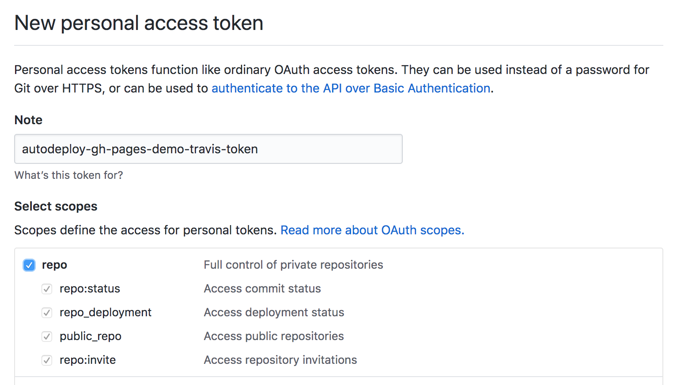
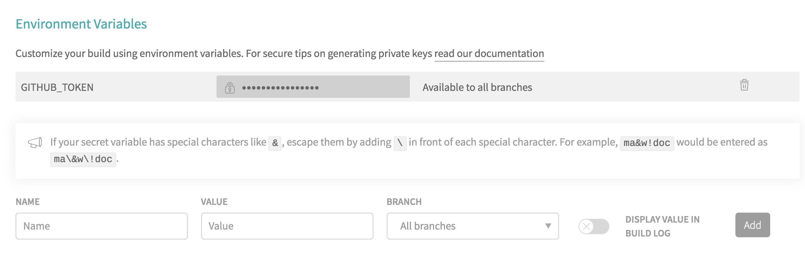
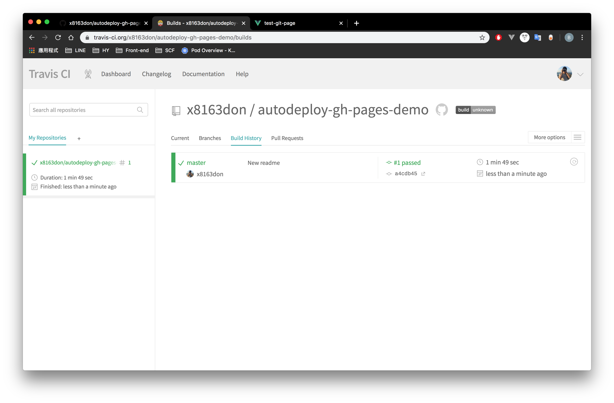
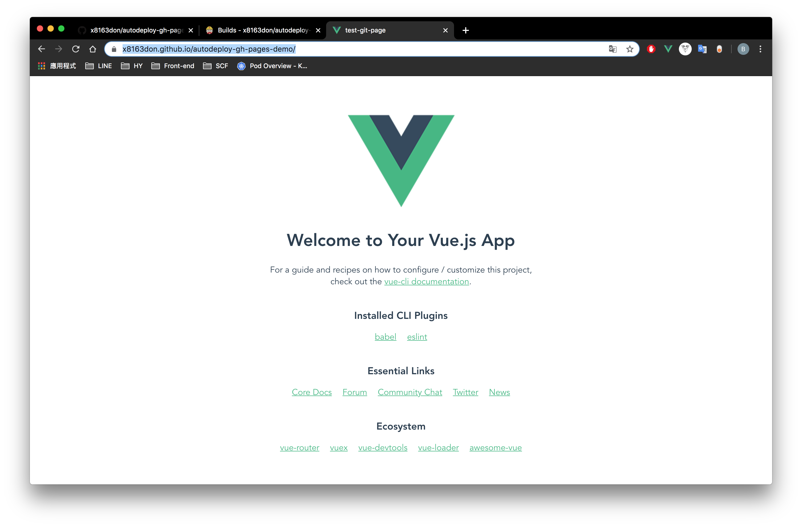

# How to automatically deploy project build result to git-page?

## Technique
* Vue (for demo website)
* Travis CI

## Project aspect
1. Add `.travis.yml` file in project
1. Code as following
```
language: node_js
node_js: stable

cache:
  directories:
    - node_modules

before_deploy:
  - "npm run build"

script: echo "npm test temporarily disabled"

deploy:
  provider: pages
  skip_cleanup: true
  github_token: $GITHUB_TOKEN
  local_dir: dist
  on:
    branch: master
    
```
 Notice: for quickly demo I skip test phase on npm if you need this phase. you can remove `script: echo "npm test temporarily disabled"` line.

## Git Token setup
1. On github go here: https://github.com/settings/tokens 
1. Add git token for Travis CI 
   
   make sure new token has public_repo authentication

1. Copy the token (string in the green background)

## Travis CI setup

1. connect & activity reop
1. more options > settings
1. add environment variable key as "GITHUB_TOKEN" and value as token string



## Finish!
whenever the master branch has new commit then Travis CI will auto build & deploy all files of under dist folder to `gh-pages` branch

then you can connect to `https://{your_account}.github.io/{repo_name}` check result



